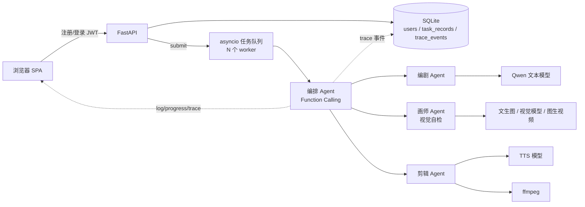
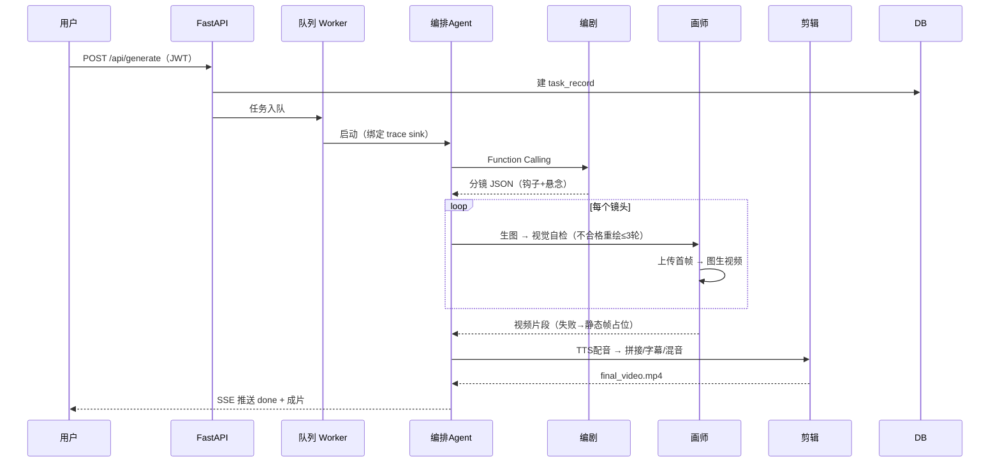

# AI漫剧一键生成平台

用户在网页输入 **剧情 / 角色 / 场景 / 画风 / 画幅**，注册登录后点击一键生成，
由 **4 个 Agent（编排 / 编剧 / 画师 / 剪辑）协作**，自动产出一条带配音、字幕、
背景音乐的完整漫剧视频（MP4），可在线播放、下载，并在「我的作品」中随时回看。

---

## 技术栈与选型理由

| 层 | 技术 | 为什么选它 |
|---|---|---|
| Web 框架 | **FastAPI** | 原生 async，适合大量等待模型响应的 IO 密集场景；自带接口文档 |
| ASGI 服务器 | Uvicorn | FastAPI 标配 |
| 前端 | **原生 HTML/CSS/JS 单页** | 页面交互不复杂，不引入构建工具，SSE 天然适合实时日志 |
| 实时通信 | **SSE**（Server-Sent Events） | 只需服务端单向推送日志/进度，比 WebSocket 简单 |
| 数据库 | **SQLAlchemy 2.0 + SQLite** | 零配置本地文件；ORM 与表结构清晰，换 MySQL 仅改连接串 |
| 认证 | **JWT（PyJWT）+ bcrypt** | 无状态、前后端分离；bcrypt 是标准密码哈希方案 |
| 任务调度 | **自研 asyncio 任务队列**（worker pool） | 单机零外部依赖，并发可控；预留 arq/Celery + Redis 替换路径 |
| 可观测 | **自研 trace 埋点**（contextvars） | 记录每一步 Agent/模型/耗时/状态，落库 + 实时推送 |
| 媒体处理 | **ffmpeg / ffprobe** | 视频拼接、字幕烧录、混音的工业标准 |
| 模型平台 | **阿里云百炼**（Qwen / 万相） | 多模态模型齐全，有免费额度，OpenAI 兼容协议 |

> 没有使用 LangChain/LangGraph 等 Agent 框架：编排逻辑用原生 Function Calling
> 手写，每一步可控、可调试（详见 [INTERVIEW.md](INTERVIEW.md)）。

---

## 系统架构



## 生成流程（时序）



---

## 三步跑通

```bash
# 1. 安装依赖（Python 3.10+）
pip install -r requirements.txt
# 另需 ffmpeg 加入 PATH：winget install Gyan.FFmpeg

# 2. 配置密钥
copy .env.example .env      # Windows
#   填入百炼 API-KEY（控制台右上角头像 → API-KEY 管理）
#   生产环境务必设置随机 JWT_SECRET

# 3. 启动
uvicorn main:app --host 127.0.0.1 --port 8000
```

打开 <http://127.0.0.1:8000>，注册 → 登录 → 填写表单 → 一键生成。

---

## 目录结构

```
AnimAI/
├── main.py                 # FastAPI 入口：认证、任务提交(队列化)、SSE、静态服务
├── auth.py                 # bcrypt 哈希 + JWT 签发/校验 + 当前用户依赖
├── db.py                   # SQLAlchemy：User / TaskRecord / TraceEvent + 仓库函数
├── state.py                # TaskContext：流水线共享 JSON 上下文（内存态）
├── config.py               # 环境变量配置（模型、DB、JWT、队列并发数）
├── INTERVIEW.md            # 面试难点故事（STAR）与常见问题
├── MODELS.md               # 模型清单（换模型时同步更新）
├── agents/
│   ├── orchestrator.py     # 编排Agent：并行工具调用(一次决策全调度) + 前置依赖 + 降级
│   ├── screenwriter.py     # 编剧Agent：剧情 → 分镜 JSON（冲突钩子+结尾悬念）
│   ├── artist.py           # 画师Agent：角色前缀 + 并发关键帧(自检重绘) + 并发图生视频
│   └── editor.py           # 剪辑Agent：并发归一化/TTS + ffmpeg 拼接/字幕/混音 + 自检
├── tools/
│   ├── llm.py              # Qwen 对话（OpenAI 兼容，Function Calling）
│   ├── t2i.py              # 文生图（multimodal-generation 端点）
│   ├── vision.py           # 视觉自检（omni，OpenAI 兼容 chat）
│   ├── i2v.py              # 图生视频（上传→提交→轮询→下载）
│   ├── upload.py           # 百炼临时存储上传（→ oss:// URL，48h）
│   ├── tts.py              # 语音合成（空间专属 host）
│   ├── dash_tasks.py       # 异步任务通用器（提交/轮询/下载，轮询容错）
│   ├── job_queue.py        # 任务队列：worker pool，限制并发
│   ├── tracer.py           # trace 埋点（contextvars，span 计时）
│   └── ffmpeg_tools.py     # ffmpeg 封装
├── frontend/
│   └── index.html          # 单页：登录注册 / 表单 / 我的作品 / trace 时间线
├── tests/
│   ├── test_upload.py          # 上传：确定性错误/重试 单元测试
│   ├── test_artist_clips.py    # 画师并发片段：顺序/占位/兜底/信号量 单元测试
│   ├── test_artist_keyframes.py # 画师并发关键帧：顺序/失败/重绘/信号量 单元测试
│   ├── test_editor_concurrent.py # 剪辑并发：时间线/TTS峰值/失败静音/归一化 单元测试
│   └── test_orchestrator_parallel.py # 编排并行调用：往返次数/乱序恢复/消息补写/补齐 单元测试
├── data/animai.db          # SQLite（运行后生成，已 gitignore）
└── output/<task_id>/       # 关键帧 / 片段 / 成片 / context.json
```

---

## API 一览

| 方法 | 路径 | 鉴权 | 说明 |
|---|---|---|---|
| POST | `/api/auth/register` | - | 注册，返回 JWT |
| POST | `/api/auth/login` | - | 登录，返回 JWT |
| GET | `/api/auth/me` | Bearer | 当前用户信息 |
| POST | `/api/generate` | Bearer | 提交生成任务，返回 task_id（任务进队列） |
| POST | `/api/tasks/{id}/pause` | Bearer | 暂停任务（协作式挂起，当前步骤完成后在安全点等待） |
| POST | `/api/tasks/{id}/resume` | Bearer | 继续已暂停的任务 |
| GET | `/api/tasks` | Bearer | 我的作品列表 |
| GET | `/api/tasks/{id}` | Bearer | 任务状态 |
| GET | `/api/tasks/{id}/trace` | Bearer | 链路 trace 事件 |
| GET | `/api/tasks/{id}/events?token=` | JWT 查询参数 | SSE：log / progress / trace / done / error |

> SSE 用 EventSource（无法自定义请求头），JWT 通过 `?token=` 传递。

---

## 容错设计

- **暂停/继续**：生成中可随时点暂停。采用**协作式挂起**——只在步骤边界
  （镜头之间、轮询间隙、合成前）的安全点等待，不强行 cancel 进行中的网络请求，
  避免半成品文件；暂停期间零外部调用，继续后无缝衔接。
- 每个外部调用失败自动重试 2 次（指数退避）；
- **确定性错误不重试**：文件不存在、代码缺陷立即抛出，避免请求风暴；
- 关键帧缺失/图生视频失败 → 黑屏或静态帧占位；TTS 失败 → 静音占位；
  单镜头失败**不中断**整条流水线；
- 异步任务轮询连续 3 次失败才判死，容忍单次网络抖动。

**性能优化**（全部通过信号量限流，可在 `.env` 调整）：
- **编排并行工具调用**：模型一条回复给出全部 Agent 调用，LLM 决策往返从 4~5 次降到 2 次，省约 1~1.5 分钟；
- **关键帧并发生成**（`MAX_CONCURRENT_KEYFRAMES` 默认 2），6 张关键帧从约 7 分钟压缩到约 3.5 分钟；
- **图生视频片段并发提交**（`MAX_CONCURRENT_CLIPS` 默认 3），6 个片段从约 4.5 分钟压缩到约 1.5 分钟；
- **剪辑并发**（`MAX_CONCURRENT_EDITOR` 默认 3）：归一化与 TTS 配音并发，剪辑阶段从约 2 分钟压缩到约 1 分钟；
- 关键帧缺失的镜头不占并发名额，直接黑屏占位。

6 镜头端到端总耗时：从最初的约 16 分钟压缩到约 **8~10 分钟**。

---

## 踩坑记录（详见 INTERVIEW.md）

1. **图生视频首帧传 Base64 → 400 Arrearage**：计费网关拦截 data URI，
   必须先上传百炼临时存储拿 `oss://` URL，提交头加 `X-DashScope-OssResourceResolve: enable`；
2. **文生图走通用域名 → 404**：OpenAI images 路由只挂业务空间专属 host，
   文生图改用 `multimodal-generation` 原生端点；
3. **重试风暴**：缺失文件被层层重试（upload×i2v），改为确定性错误立即失败；
4. **TTS 必须走空间专属 host**，通用域名报 `Engine error 411`。

---

## 测试

```bash
.venv\Scripts\python.exe -m pytest tests/ -v
```
